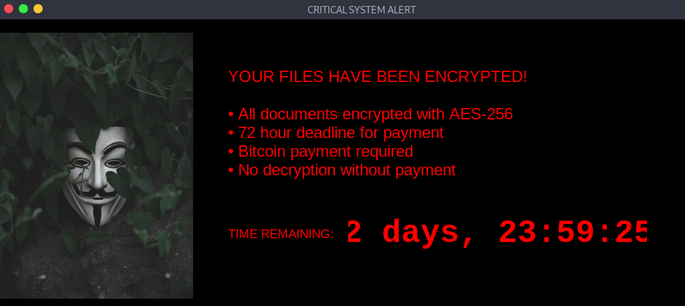

# Ransomware python implementation 🔒



> **⚠️ Educational Use Only**  
> Simulated ransomware for cybersecurity training. Never deploy maliciously.

## Intro
Python-based ransomware simulation demonstrating:
- AES-256 file encryption/decryption  
- Psychological pressure tactics in ransomware GUIs  
- Basic defensive monitoring  
- Ethical reverse engineering concepts  

## Purpose 🎯
- Train analysts in ransomware behavior analysis  
- Develop defensive pattern recognition  
- Understand encryption mechanisms  
- Practice incident response workflows  

## Usage 🛠️
```bash
# 1. Install dependencies
pip install cryptography pillow

# 2. Setup environment
mkdir victim_dir && echo "Test" > victim_dir/test.txt

# 3. Run demo
python ransomware_demo.py

# 4. Monitor with
python ransom_detector.py
```

## Contribution 🤝
Contributions are welcome! If you'd like to contribute to this project, please follow these steps:

1. Fork the repository.
2. Create a new branch (`git checkout -b feature/YourFeature`).
3. Make your changes and commit them (`git commit -m 'Add some feature'`).
4. Push to the branch (`git push origin feature/YourFeature`).
5. Open a pull request.

6. Report issues for:
   - UI/UX improvements
   - Cryptographic enhancements
   - Detection evasion techniques
7. Submit PRs with:
   - Clear documentation
   - VirtualBox safety checks
   - Ethical use safeguards

## Checklist (Improvements Needed) 📋
- 🎯 Add fake Bitcoin payment API call simulation  
- 🎯 Implement process hollowing evasion  
- 🎯 Add entropy analysis counter-detection  
- 🎯 Create decoy file generation system  
- 🎯 Develop anti-debugging techniques  
- 🎯 Add network traffic spoofing  
- 🎯 Improve GUI psychological pressure elements  
- 🎯 Implement VBox detection & self-destruct  

## License 📜
This project is licensed under the MIT License. See the [LICENSE](LICENSE) file for details.